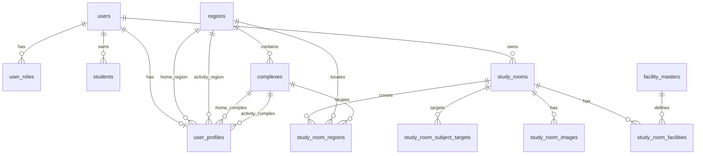

# DB 설계 개요

MySQL 8, `utf8mb4_unicode_ci`.  
기준 DDL: [sql/schema/001_init.sql](../../sql/schema/001_init.sql)

## ER 요약 (현재 잠금 범위)



과외쌤(`tutors` 등)은 DDL 미확정 — [tutors.md](tutors.md) 참고.

## 테이블 목록 (001_init.sql + 002)

| # | 테이블 | 그룹 | 문서 |
|---|--------|------|------|
| 1 | users | 회원 | [members.md](members.md) |
| 2 | user_profiles | 회원 | [members.md](members.md) — **002** gender, birth_date, address, consent |
| 3 | user_roles | 회원 | [members.md](members.md) |
| 4 | students | 회원 | [members.md](members.md) |
| 5 | regions | 지역 | [04-location-policy.md](../04-location-policy.md) |
| 6 | complexes | 지역 | [04-location-policy.md](../04-location-policy.md) |
| 7 | study_rooms | 공부방 | [study_rooms.md](study_rooms.md) |
| 8 | study_room_regions | 공부방 | [study_rooms.md](study_rooms.md) |
| 9 | study_room_subject_targets | 공부방 | [study_rooms.md](study_rooms.md) |
| 10 | study_room_images | 공부방 | [study_rooms.md](study_rooms.md) |
| 11 | facility_masters | 공부방 | [study_rooms.md](study_rooms.md) |
| 12 | study_room_facilities | 공부방 | [study_rooms.md](study_rooms.md) |

## 공통 규칙

| 항목 | 규칙 |
|------|------|
| PK | `BIGINT UNSIGNED AUTO_INCREMENT` (마스터 `facility_masters.id`만 `SMALLINT UNSIGNED`) |
| 문자셋 | `utf8mb4` / `utf8mb4_unicode_ci` |
| 타임스탬프 | `created_at`, `updated_at` — `DEFAULT CURRENT_TIMESTAMP` |
| soft delete | `study_rooms.deleted_at` 만 사용 (1차) |
| FK 삭제 | 회원·지역 마스터 → `RESTRICT` (기본), 공부방 자식 테이블 → `ON DELETE CASCADE` |
| ENUM | MySQL `ENUM` 리터럴 그대로 사용 (`'active'`, `'elementary'` 등) |
| CHECK | `study_room_regions.slot` 1~3, `study_room_images.sort_order` 1~5 |

## DDL 적용

```bash
mysql -u root -p < sql/schema/001_init.sql
mysql -u root -p study114 < sql/schema/002_profile_signup_fields.sql
mysql -u root -p study114 < sql/schema/004_member_ssot_align.sql
mysql -u root -p study114 < sql/schema/005_study_room_ssot_align.sql
mysql -u root -p study114 < sql/schema/006_facility_masters_seed.sql
```

FK 생성 순서는 스크립트 내 테이블 정의 순서와 동일.

## 추후 (본 문서 범위 외)

- `facility_masters` 시드 SQL
- 과외쌤 스키마 (`tutors`, `tutor_subjects`, `tutor_regions`)
