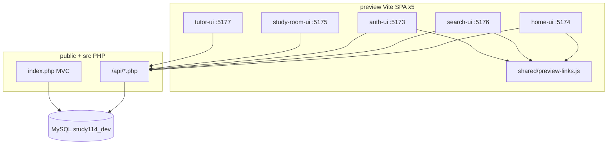

# 우동공과(study114) — 프로젝트 트리·중요 파일 역할 정의

**문서 성격:** Notion·내부 논의용 인벤토리 (현재 코드베이스 기준)  
**기준일:** 2026-07-10  
**Notion:** [부록 — 프로젝트 트리·중요 파일 역할 (코드베이스 지도)](https://app.notion.com/p/3979d518fe7781909f1ec66001ae798c)  
**대상 독자:** 기획·디자인·개발·배포 논의 참여자  
**관련 문서:** [01-project-overview.md](../01-project-overview.md) · [02-folder-structure.md](../02-folder-structure.md) · [ssot/README.md](../ssot/README.md) · [internal/README.md](./README.md) · [01-dothome-deploy.md](./01-dothome-deploy.md)

---

## 0. 한 줄 정의

> **PHP 8 + MySQL 백엔드**와 **Vite 바닐라 JS 프리뷰 SPA 5개**가 분리된 하이브리드 구조.  
> 설계 기준은 `docs/ssot/`, 실행 코드는 `src/` + `public/` + `preview/`에 있다.

---

## 1. 최상위 트리 (논의용)

```
study114/
├── README.md                 # 프로젝트 입구·로컬 실행 요약
├── package.json              # 루트: Playwright e2e·스크립트만 (앱 빌드 아님)
│
├── config/                   # ★ PHP 런타임 설정 (DB·OAuth·스토리지)
├── public/                   # ★ 웹 document root (API 진입·정적 자산)
├── src/                      # ★ PHP 애플리케이션 (MVC-lite)
├── sql/schema/               # ★ MySQL DDL·dev seed (34파일)
├── storage/                  # 런타임 쓰기 (로그·첨부, gitignore)
│
├── preview/                  # ★ UI 프리뷰 (Vite SPA × 5 + shared)
│   ├── auth-ui/              # :5173 인증·가입
│   ├── home-ui/              # :5174 메인·마이페이지·관리자 등
│   ├── study-room-ui/        # :5175 공부방 등록
│   ├── search-ui/            # :5176 검색
│   ├── tutor-ui/             # :5177 과외쌤 등록
│   └── shared/               # 프리뷰 패키지 공용 (링크·지도·정책)
│
├── docs/
│   ├── ssot/                 # ★ 설계 SSOT (장별 md)
│   ├── database/             # DB 도메인 설명
│   ├── internal/             # ★ 내부·배포 (README · 닷홈/카페24 가이드)
│   └── release/              # 릴리스·QA 메모
│
├── docker/                   # 로컬 MySQL + PHP API 컨테이너
├── scripts/                  # 스키마·빌드·검증
│   ├── apply-schema-dev.ps1
│   ├── build-dothome.ps1     # ★ 닷홈 빌드 (npm run build:dothome)
│   ├── build-staging.ps1     # 카페24 빌드
│   └── build-shared-hosting.ps1
├── .github/workflows/        # ★ deploy.yml — CI build:dothome → FTP public/
├── .cursor/rules/            # Cursor 작업 원칙 (study114-workflow.mdc)
├── e2e/                      # Playwright API·운영 스모크
└── legacy/                   # 참고용 구보드 (운영 비포함)
```

**★ = 외부 검수·스테이징·운영 논의 시 반드시 짚을 폴더**

---

## 2. 기술 스택 판별표

| 구분 | 이 프로젝트 | 비고 |
|------|-------------|------|
| 프론트 프레임워크 | **Vite + 바닐라 JS** | React/Next/Vue **아님** |
| 프론트 라우팅 | **Hash SPA** (`#/parent`, `#/search/room`) | 새로고침 부담 상대적으로 낮음 |
| 백엔드 | **PHP 8.2+ MVC-lite** | Composer/vendor 없음, 자체 autoload |
| DB | **MySQL 8** | 검색·로그인·등록·쪽지 등 대부분 필수 |
| API 형태 | `public/api/**/*.php` JSON + `public/index.php` MVC | Node API 서버 **없음** |
| 로컬 개발 | Docker MySQL + `php -S :8080` + Vite 5포트 | `docker/docker-compose.dev.yml` |

---

## 3. 백엔드 트리 (`public/` + `src/`)

### 3-1. `public/` — 웹에 노출되는 진입점

```
public/
├── index.php                    # MVC 프론트 컨트롤러 (정적 파일 우선)
├── index.html                   # home-ui 빌드 산출물 (build:dothome 후)
├── .htaccess                    # ★ Apache SPA fallback + MVC (닷홈 안전 최소본)
├── assets/                      # MVC css/brand + SPA 빌드 자산
│   ├── css/auth/                # PHP MVC 가입/로그인 화면 스타일 (Git 추적)
│   ├── brand/                   # 로고 등 (Git 추적)
│   └── index-*.js / index-*.css # SPA 빌드 산출물 (gitignore, CI 생성)
├── auth/                        # auth-ui SPA 빌드 (gitignore)
├── search/                      # search-ui SPA 빌드 (gitignore)
├── register/
│   ├── room/                    # study-room-ui SPA 빌드 (gitignore)
│   └── tutor/                   # tutor-ui SPA 빌드 (gitignore)
└── api/                         # JSON API (Git 추적)
    ├── auth/                    # 로그인·가입·OAuth·비밀번호·이메일인증
    ├── search/search.php        # 13장 검색
    ├── registrations/           # 마이페이지 등록 허브 (공부방·과외·학생)
    ├── study-room/register.php  # 공부방 등록 저장
    ├── tutor/register.php       # 과외쌤 등록 저장
    ├── handoff/                 # 찜·비교·최근본·학생검토 (25장)
    ├── messages/                # 쪽지·열람권 (16장)
    ├── paid/                    # 유료·ROI·티켓·결제 placeholder (18장)
    ├── support/                 # 고객센터·티켓 (17장)
    ├── board/                   # 게시·첨부 (21장 엔진)
    ├── admin/                   # 운영 콘솔 API (28장)
    ├── cron/paid-reminders.php  # 리마인더 cron 엔드포인트
    └── health/db.php            # ⚠️ DB 연결 임시 테스트 (배포 후 삭제)
```

> 운영 서버: `public/` 내용 → 닷홈 `html/` · `src/`·`config/`·`storage/`는 `html/` **형제** 폴더.  
> **자동배포:** `.github/workflows/deploy.yml`이 CI에서 `build:dothome` 후 `public/`만 FTP.  
> **gitignore:** `index.html`, SPA 폴더, `assets/index-*`는 Git 미추적 → CI 빌드 산출물.  
> 상세: [01-dothome-deploy.md](./01-dothome-deploy.md)

### 3-2. `src/` — PHP 도메인 로직

```
src/
├── bootstrap.php                # autoload·study114_config()
├── helpers.php                  # redirect 등 공통 헬퍼
├── routes/web.php               # MVC GET/POST 라우트 (/auth/login 등)
├── Core/                        # Router, View, Flash
├── Database/Connection.php      # PDO MySQL
├── Controllers/AuthController.php # MVC 가입·로그인 폼
├── Views/auth/                  # PHP 서버렌더 가입 화면 (auth-ui와 병행 존재)
│
├── Auth/                        # 로그인·가입·OAuth·토큰·메일
├── Search/SearchService.php     # room/tutor/student 검색
├── StudyRoom/StudyRoomRegisterService.php
├── Tutor/TutorRegisterService.php
├── Registration/                  # 마이페이지 등록 허브 (3종)
├── Handoff/                     # 찜·비교·recent
├── Messages/                    # 쪽지·paid gate
├── Paid/                        # 유료 서비스·ROI·티켓·리마인더
├── Support/                     # 고객센터
├── Board/                       # 게시·첨부 스토리지
└── Admin/                       # 노출·신고·제출큐·운영로그
```

### 3-3. `config/` — 환경별 설정

| 파일 | 역할 |
|------|------|
| `database.php` | MySQL 접속 (**gitignore**, 서버마다 생성) |
| `database.php.example` | 로컬 Docker DB 예시 |
| `database.php.dothome.example` | **닷홈** DB (`study114` / localhost) |
| `database.php.cafe24-staging.example` | 카페24 스테이징 DB 예시 |
| `dothome.env.example` | 닷홈 PHP 환경변수 참고표 |
| `staging.env.example` | 카페24 PHP 환경변수 참고표 |
| `auth.php` | `STUDY114_AUTH_UI` / `HOME_UI` / `API_BASE`, 메일·토큰 TTL |
| `oauth.php` | 네이버·카카오·구글 redirect URI·클라이언트 키 |
| `oauth.env.example` | OAuth 환경변수 템플릿 (로컬) |
| `paid.php` | cron 키·SMS 로그·home UI URL |
| `storage.php` | 첨부 루트·다운로드 토큰·허용 확장자 |
| `app.php` | 앱명·`STUDY114_API_BASE`·env·debug |

### 3-4. `sql/schema/` — DB 마이그레이션

- `001_init.sql` ~ `033_*.sql` 순서 적용 (`scripts/apply-schema-dev.ps1`)
- **`012_search_dev_seed.sql`**: 로컬 검색·로그인 검증용 계정/공부방/과외/학생 시드
- **`033_study_room_map_coords.sql`**: 공부방 대표 좌표 (지도 1차)

---

## 4. 프론트 프리뷰 트리 (`preview/`)

로컬 개발 시 **앱마다 별도 Vite dev 서버 포트**를 쓴다.  
앱 간 링크 SSOT: `preview/shared/preview-links.js` — 로컬은 `127.0.0.1:517x` 폴백, **배포는 빌드 시 `VITE_*_UI_BASE`** (`preview/.env.dothome.example` 등).

### 4-1. 공통 `preview/shared/`

| 파일 | 역할 |
|------|------|
| `preview-links.js` | **앱 간 URL SSOT** (auth/home/search/register·GNB 링크) |
| `vite-base.mjs` | Vite `base` 경로 (`VITE_BASE_PATH` / 로컬 `/`) |
| `naver-map.js` | 네이버 지도 1차 (`VITE_NAVER_MAP_CLIENT_ID`) |
| `auth-redirect.js` | 소셜 로그인 시작 URL 조립 |
| `password-policy.js` | 비밀번호 규칙 공유 |
| `promo-links.js` | 상세 SNS·홍보 링크 렌더 |
| `student-auth-bridge.js` | 학생 가입 플로우 브리지 |

**빌드 env 예시:** `preview/.env.dothome.example` · `preview/.env.staging.example`

### 4-2. `preview/home-ui/` — 메인 허브 (:5174)

**SSOT:** 9장 메인 · 11장 노출 · 24·25장 상세·handoff · 15장 마이페이지 · 28장 admin

```
preview/home-ui/
├── index.html
├── vite.config.js             # /api → :8080 프록시
├── package.json               # vite build / dev
├── DOC-CHECKLIST.md           # SSOT 대비 구현 체크
├── SSOT-ALIGNMENT.md          # 잠금 기준 ↔ 코드 정합
└── src/
    ├── main.js                # ★ 앱 부트·화면 라우팅 분기
    ├── state.js               # ★ hash 라우트·previewState·역할
    ├── layout.js              # GNB·유틸 2층·셸
    ├── nav-config.js          # GNB 6항목·1차 제외 메뉴
    ├── data.js                # 데모 지역·AUTH_UI_BASE 재export
    │
    ├── screens/               # 4종 메인 화면
    │   ├── guest.js           # 비회원 (지도 히어로·Prime/Pick)
    │   ├── parent.js          # 학부모 홈 2탭
    │   ├── study-room.js      # 공부방 운영자 홈
    │   └── tutor.js           # 과외쌤 홈
    │
    ├── guest-sections.js      # 비회원 지도·노출 박스·리스트
    ├── provider-home.js       # 공급자/학부모 2탭 + search-find-surface 연동
    ├── exposure-data.js       # 11장 mock 풀 (공부방·과외·학생)
    ├── exposure-render.js     # Prime/Pick/Basic 카드 렌더
    ├── exposure-bridge.js     # mock ↔ 실DB 검색 API 브리지
    │
    ├── detail-decision/       # 24장 상세 모달
    │   ├── detail-shell.js    # ★ 모달 열기/닫기·CTA·찜·비교
    │   ├── studyroom-detail.js
    │   └── tutor-detail.js
    │
    ├── handoff-*.js             # 25장 찜·비교·재방문·스티커
    ├── compare-modal.js         # 비교검색 표 모달
    ├── mypage/                  # 15장 마이페이지
    ├── messages/                # 16장 쪽지함
    ├── support/                 # 17장 고객센터
    ├── admin/                   # 28장 운영 콘솔
    ├── library/                 # 자료실 프리뷰
    ├── policy-index.js          # 약관·정책
    ├── study-room-reg/          # 공부방 등록 관리 (홈 내)
    ├── tutor-reg/               # 과외 등록 관리 (홈 내)
    └── styles/
        ├── tokens.css           # 디자인 토큰
        └── home.css             # ★ 메인 레이아웃·지도·노출 스타일
```

### 4-3. `preview/search-ui/` — 검색 (:5176)

**SSOT:** 13장 검색 필드·탭·지역 피드·지도형 문법

```
preview/search-ui/src/
├── main.js
├── screens/search-page.js     # 검색 페이지 셸
├── search-find-surface.js     # ★ 홈·검색 공용 (지도+폼+결과)
├── search-schema.js           # DB 컬럼명 1:1 필드 정의
├── search-map.js              # 공부방 지도 블록·핀-카드 동기화
├── search-api.js              # POST /api/search/search.php
├── search-exposure-mapper.js  # API 결과 → 11장 노출 아이템
├── search-tier-render.js      # Prime/Pick/Basic 결과 레이아웃
├── search-region-feed.js      # 검색 전 지역 피드
├── search-role-access.js      # 역할별 탭 노출
├── search-provider-self.js    # 내 노출 vs 경쟁 확인
└── search-handoff.js          # 찜·비교·상세 연동
```

### 4-4. `preview/auth-ui/` — 인증·가입 (:5173)

**SSOT:** 2장 · 9장 부록 · 14장

```
preview/auth-ui/src/
├── main.js
├── layout.js
├── auth-api.js                # /api/auth/* 클라이언트
├── state.js
└── screens/
    ├── login.js
    ├── signup-terms.js → signup-role → signup-form → signup-basic
    ├── find-id.js / find-password.js / reset-password.js
    └── signup-complete.js
```

### 4-5. `preview/study-room-ui/` — 공부방 등록 (:5175)

**SSOT:** 5장 · 20장

```
preview/study-room-ui/src/
├── main.js
├── state.js                   # 단계별 폼 상태
├── form-collect.js            # payload 조립
├── register-api.js            # /api/study-room/register.php
├── save-flow.js
└── screens/step-*.js          # basic → location → lesson → facility → career → complete
```

### 4-6. `preview/tutor-ui/` — 과외쌤 등록 (:5177)

**SSOT:** 8장 · 21장

```
preview/tutor-ui/src/
├── main.js
├── state.js / form-collect.js / register-api.js
└── screens/step-*.js          # basic → regions → lesson → career → contact → complete
```

---

## 5. 설계 문서 트리 (`docs/ssot/`)

| 장 | 파일 | 다루는 것 |
|----|------|-----------|
| 2장 | `02-registration-and-member-db.md` | 가입·회원 개념 |
| 4장 | `04-member-db-and-role-profiles.md` | 회원/역할 DB SSOT |
| 5장 | `05-study-room-db.md` | 공부방 DB |
| 6장 | `06-phase1-menu-structure.md` | 1차 메뉴·제외 기능 |
| 8장 | `08-tutor-registration-db.md` | 과외 DB |
| 9장 | `09-main-screen-roles.md` | 메인 4종 UI |
| 10장 | `10-phase1-execution-plan.md` | 구현 순서 |
| 11장 | `11-main-exposure-and-compare.md` | 노출·비교 |
| 13장 | `13-search-page-fields.md` | 검색 UI·필드 |
| 24장 | `24-detail-decision-layer.md` | 상세 모달·판단 UX |
| 25장 | `25-decision-handoff-layer.md` | 찜·비교·handoff |
| 30장 | `30-first-route-map-and-screen-inventory.md` | 라우트맵·화면 ID |

**우선순위:** `docs/ssot/` ↔ 다른 `docs/` 충돌 시 **SSOT 승**

각 프리뷰 패키지의 `DOC-CHECKLIST.md`는 해당 장 대비 **구현 완료/미완** 추적용.

---

## 6. 중요 파일 역할 — 핵심만 (논의 시 자주 쓰는 것)

### 6-1. “이 파일 건드리면 어디가 흔들리나”

| 파일 | 역할 | 건드리면 영향 |
|------|------|----------------|
| `preview/shared/preview-links.js` | 앱 간 URL·GNB 외부 링크 | **전체 화면 흐름·배포 URL** |
| `preview/home-ui/src/nav-config.js` | GNB 6항목·메뉴 제외 | 전역 내비 |
| `preview/home-ui/src/state.js` | hash 라우트·역할·find state | home-ui 모든 화면 |
| `preview/search-ui/src/search-find-surface.js` | 검색+홈 공용 탐색 UI | home 3역할 + search-ui |
| `preview/home-ui/src/exposure-data.js` | mock 노출 데이터 | 비로그인·API 실패 시 화면 |
| `preview/home-ui/src/exposure-bridge.js` | 로그인 시 실DB ID 치환 | 로그인 후 목록 정합 |
| `src/Search/SearchService.php` | 검색 SQL·필터 | search-ui·홈 피드 |
| `config/database.php` | DB 접속 | **API 전체** |
| `config/oauth.php` | 소셜 로그인 callback | OAuth 성공/실패 |
| `public/.htaccess` | Apache rewrite·SPA fallback | 배포 환경 라우팅 전체 |
| `sql/schema/*.sql` | 테이블·시드 | DB 없으면 API 대부분 불가 |

### 6-2. API ↔ UI 매핑 (대표)

| API (`public/api/`) | PHP 서비스 | 주 UI 소비자 |
|---------------------|------------|--------------|
| `search/search.php` | `SearchService` | search-ui, home-ui bridge |
| `auth/login.php`, `me.php` | `LoginService`, `AuthSession` | auth-ui, home-ui session |
| `auth/oauth/*` | `OAuthService` | auth-ui 소셜 |
| `study-room/register.php` | `StudyRoomRegisterService` | study-room-ui |
| `tutor/register.php` | `TutorRegisterService` | tutor-ui |
| `handoff/*.php` | `HandoffService` | home-ui, search-ui |
| `messages/threads.php` | `MessagesService` | home-ui messages |
| `admin/*.php` | `Admin*` | home-ui admin |

### 6-3. 로컬 실행 진입점

| 목적 | 명령/경로 |
|------|-----------|
| DB | `docker compose -f docker/docker-compose.dev.yml up -d` |
| 스키마 | `.\scripts\apply-schema-dev.ps1` |
| PHP API | Docker `study114-api-dev` (:8080) 또는 `scripts/run-api-dev.ps1` |
| 메인 UI | `cd preview/home-ui && npm run dev` → :5174 |
| 검색 UI | `cd preview/search-ui && npm run dev` → :5176 |
| 가입 UI | `cd preview/auth-ui && npm run dev` → :5173 |

### 6-4. shared hosting 배포 진입점

| 목적 | 명령/문서 |
|------|-----------|
| **닷홈 자동배포** | `main` push → `.github/workflows/deploy.yml` |
| **닷홈 로컬 빌드** | `npm run build:dothome` → [01-dothome-deploy.md](./01-dothome-deploy.md) |
| GitHub Variable | `VITE_NAVER_MAP_CLIENT_ID` (지도 키, CI 빌드 주입) |
| GitHub Secret | `FTP_PASSWORD` |
| 카페24 빌드 | `npm run build:staging` → [01-cafe24-staging-deploy.md](./01-cafe24-staging-deploy.md) |
| 공통 빌드 엔진 | `scripts/build-shared-hosting.ps1` |
| 닷홈 DB 설정 | `config/database.php.dothome.example` → `database.php` |
| DB 연결 테스트 | `public/api/health/db.php` (확인 후 삭제) |
| phpMyAdmin 스키마 | `sql/schema/001`~`033` 순서 import |
| Cursor 작업 원칙 | `.cursor/rules/study114-workflow.mdc` |

**닷홈 FTP 배치**

| 대상 | 경로 | 배포 방식 |
|------|------|-----------|
| `public/*` | `html/` | **Actions 자동** (CI 빌드 후) |
| `src/` | `html` 형제 `src/` | 수동 (최초·PHP 변경 시) |
| `config/` | `html` 형제 `config/` | 수동 (`database.php` 서버 전용) |
| `storage/` | `html` 형제 `storage/` | 수동 (쓰기 권한) |

**배포 제외:** `docs/`, `docs/ssot/`, `backups/`, `preview/`, `e2e/`, `sql/`, `scripts/`, `docker/`, `legacy/`, `node_modules/`

---

## 7. 데이터·화면 흐름 (논의용 다이어그램)



**탐색 흐름 (학부모 예):**  
`home-ui #/parent` → GNB 공부방찾기 → `search-ui #/search/room` → 결과 카드 → `home-ui detail-modal` → 찜/비교/쪽지

---

## 8. 저장소에서 의도적으로 제외·주의하는 것

| 경로 | 이유 |
|------|------|
| `config/database.php` | 서버별 비밀 |
| `preview/*/.env.local` | 지도 Client ID 등 로컬 비밀 |
| `preview/*/.env.production.local` | 빌드 시 생성 |
| `storage/` | 런타임 생성 (첨부·로그) |
| `node_modules/` | 로컬 npm 설치 |
| `.mysql-data/` | 로컬 DB 데이터 (있을 경우) |
| `legacy/gnuboard-*` | 참고만, 1차 운영 비포함 |
| `preview/*/dist/` | Vite 빌드 산출물 (중간 단계) |
| `public/index.html`, `public/auth/` 등 | `build:dothome` 산출물 (gitignore) |

---

## 9. Notion 논의 시 자주 나오는 질문 ↔ 이 문서 위치

| 질문 | 답 위치 |
|------|---------|
| 메뉴·GNB 구조는 어디? | `nav-config.js` + ssot 6장 |
| 화면 ID·라우트맵? | ssot 30장 + `home-ui/state.js` ROUTES |
| 검색 필드명은 DB와 같나? | `search-schema.js` (13장 1:1) |
| mock vs 실데이터? | `exposure-data.js` vs `exposure-bridge.js` |
| 지도는 어디까지? | `shared/naver-map.js` + ssot 30장 부록(Notion) |
| 배포 document root? | `public/` → 닷홈 `html/` ([01-dothome-deploy.md](./01-dothome-deploy.md)) |
| 프론트 자동배포? | `main` push → `.github/workflows/deploy.yml` (CI `build:dothome` → FTP `public/`) |
| 지도 키는 어디? | GitHub Variable `VITE_NAVER_MAP_CLIENT_ID` · 로컬은 `.env.dothome.example` |
| 닷홈 DB·FTP 설정? | [01-dothome-deploy.md](./01-dothome-deploy.md) · `database.php.dothome.example` |
| 운영 URL 바꾸려면? | `preview/.env.dothome.example` + 재빌드 · `public/.htaccess` SetEnv · `config/auth.php` |
| 카페24 스테이징? | [01-cafe24-staging-deploy.md](./01-cafe24-staging-deploy.md) (참고) |

---

## 10. 문서 유지 규칙 (제안)

1. **구조가 바뀌면** 이 문서의 §1·§3·§4 트리를 먼저 갱신한다.
2. **새 API 추가 시** §6-2 표에 한 줄 추가한다.
3. **SSOT 장이 바뀌면** `docs/ssot/README.md`가 원본, 이 문서는 **코드 위치 인덱스** 역할만 한다.
4. Notion에는 이 문서를 **「코드베이스 지도」** 로 링크하고, 상세 스펙은 ssot 장 문서를 링크한다.

---

## 변경 이력

| 날짜 | 내용 |
|------|------|
| 2026-07-09 | 최초 작성 — 트리·중요 파일·API 매핑·논의 FAQ |
| 2026-07-09 | 닷홈 배포·빌드 스크립트·config 예시·public SPA 트리 반영 |
| 2026-07-10 | GitHub Actions CI 배포·gitignore 산출물·배포 포함/제외·FAQ 갱신 |
