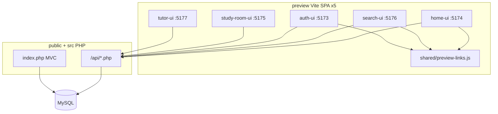

# 우동공과(study114) — 프로젝트 트리·중요 파일 역할 정의

**문서 성격:** 내부용 코드베이스 지도 (파일 트리맵)  
**기준일:** 2026-08-10  
**대상 독자:** 기획·디자인·개발·배포  
**관련 문서:** [internal/README.md](./README.md) · [01-dothome-deploy.md](./01-dothome-deploy.md) · [ssot/README.md](../ssot/README.md) · [02-folder-structure.md](../02-folder-structure.md)

---

## 0. 한 줄 정의

> **PHP 8 + MySQL 백엔드**와 **Vite 바닐라 JS 프리뷰 SPA 5개**가 분리된 하이브리드.  
> 설계 기준은 `docs/ssot/`, 실행 코드는 `src/` + `public/` + `preview/`에 있다.

---

## 1. 최상위 트리

```
study114/
├── README.md
├── package.json                 # 루트: Playwright e2e·빌드 스크립트 진입
├── playwright.config.js
│
├── config/                      # ★ PHP 런타임 설정 (DB·OAuth·스토리지)
├── public/                      # ★ 웹 document root (API·SPA 산출물)
├── src/                         # ★ PHP 애플리케이션
├── sql/schema/                  # ★ MySQL DDL 001~041 (+ rest-schema.sql)
├── storage/                     # 런타임 쓰기 (첨부·로그, gitignore)
│
├── preview/                     # ★ UI 프리뷰 (Vite SPA × 5 + shared)
│   ├── auth-ui/                 # :5173 인증·가입
│   ├── home-ui/                 # :5174 메인·마이페이지·관리·커뮤니티 등
│   ├── study-room-ui/           # :5175 공부방 등록
│   ├── search-ui/               # :5176 공부방/과외쌤 찾기
│   ├── tutor-ui/                # :5177 과외쌤 등록
│   └── shared/                  # 앱 간 URL·지도·프로모·크롬 공용
│
├── docs/
│   ├── ssot/                    # ★ 설계 SSOT
│   ├── internal/                # ★ 내부·배포·감사 메모 (본 문서)
│   ├── database/ · release/
│   └── 01~04 개요·폴더·가입·지역
│
├── scripts/                     # 스키마·빌드·시크릿 검사
├── .github/workflows/           # ★ deploy.yml (CI build:dothome → FTP)
├── .cursor/rules/               # study114-workflow.mdc
├── docker/                      # 로컬 MySQL + PHP API
├── e2e/                         # Playwright
├── legacy/ · _sample/           # 참고용 (운영 비포함)
└── tmp/ · backups/              # 작업·백업 (운영 비포함)
```

**★ = 운영·스테이징·검수 시 반드시 짚을 폴더**

---

## 2. 기술 스택 판별표

| 구분 | 이 프로젝트 |
|------|-------------|
| 프론트 | Vite + **바닐라 JS** (React/Vue 아님) |
| 라우팅 | Hash SPA (`#/parent`, `#/search/room`) |
| 백엔드 | PHP 8.2+ MVC-lite (Composer 없음) |
| DB | MySQL 8 · `sql/schema/001`~`041` |
| API | `public/api/**/*.php` JSON |
| 배포 | `main` push → Actions `build:dothome` → FTP `public/` |

---

## 3. 백엔드 (`public/` + `src/` + `config/` + `sql/`)

### 3-1. `public/` — 웹 진입점

```
public/
├── index.php                 # MVC 프론트 컨트롤러
├── index.html                # home-ui 빌드 산출물 (gitignore · CI 생성)
├── .htaccess                 # ★ SPA fallback + OAUTH_* placeholder
├── assets/                   # brand + SPA 번들(index-*.js/css, gitignore)
├── auth/ · search/ · register/room|tutor/   # 각 SPA 빌드 (gitignore)
└── api/                      # ★ JSON API (Git 추적)
    ├── auth/                 # 로그인·가입·OAuth·비번·이메일
    ├── search/search.php     # 13장 검색
    ├── study-room/ · tutor/  # 등록 저장
    ├── registrations/        # 마이페이지 등록 허브
    ├── handoff/              # 찜·비교·최근본
    ├── messages/             # 쪽지·열람권
    ├── paid/                 # 유료·ROI·티켓·결제
    ├── support/              # 고객센터
    ├── board/                # 게시·첨부 (+ 채널 ACL)
    ├── reviews/              # ★ 공급자 후기 (040)
    ├── admin/                # 운영 콘솔·콘텐츠 migrate
    ├── cron/                 # 리마인더 등
    └── health/db.php         # DB 연결 점검 (배포 후 삭제 권장)
```

### 3-2. `src/` — PHP 도메인 (중요 디렉터리)

| 경로 | 역할 |
|------|------|
| `bootstrap.php` · `autoload.php` · `helpers.php` | 부트·오토로드·공통 |
| `routes/web.php` | MVC GET/POST 라우트 |
| `Core/` | Router · View · Flash |
| `Database/Connection.php` | PDO MySQL |
| `Auth/` | 로그인·가입·OAuth·토큰·메일·비밀번호 |
| `Search/SearchService.php` | room/tutor/student 검색 SQL |
| `StudyRoom/` · `Tutor/` | 등록 저장 서비스 |
| `Registration/` | 마이페이지 허브 (공부방·과외·학생) |
| `Handoff/` | 찜·비교·recent |
| `Messages/` | 쪽지·paid gate·entitlement |
| `Paid/` | ROI·티켓·결제·리마인더·기간(`PositionPeriodCalculator`) |
| `Support/` | 공지·티켓 |
| `Board/` | 게시·첨부 · **`BoardChannelAcl`** · `BoardAccessException` |
| `Reviews/` | ★ 공급자 후기 API/리포지토리/서비스 |
| `Admin/` | 노출·신고·제출큐·회원·커머스 · **`ContentConfig*`** · schema migrate |
| `Region/` | 시도·단지 주소 보정 |
| `Controllers/` · `Views/` | PHP 서버렌더 인증 화면 (auth-ui와 병행) |

### 3-3. `config/` — 환경 설정

| 파일 | 역할 |
|------|------|
| `database.php` | MySQL 접속 (**gitignore**, 서버마다 생성) |
| `database.php.*.example` | 로컬·닷홈·카페24 예시 |
| `auth.php` | AUTH/HOME UI URL · API_BASE · 메일·TTL |
| `oauth.php` | 네이버·카카오·구글 (실시크릿은 Secrets/서버 env) |
| `paid.php` · `storage.php` · `app.php` | 유료 cron · 첨부 · 앱 메타 |
| `dothome.env.example` | 닷홈 PHP env 참고 |

### 3-4. `sql/schema/` — DDL

- `001_init.sql` ~ `041_list_sort_counters.sql` 순서 적용
- 대표: `012` 검색 시드 · `021` 보드 엔진 · `022` admin · `035` content_config · `039` Prime/Pick 기간 · `040` 후기 · `041` 목록 추천 카운터
- 정렬 DB 정합 점검: `docs/internal/42-list-sort-db-audit.md` · 검증 SQL `041_list_sort_counters.verify.sql`
- `rest-schema.sql` — 통합/참고용 덤프성 스키마 (적용 순서는 번호 SQL 우선)
- 적용: `scripts/apply-schema-dev.ps1` (로컬) · 운영은 phpMyAdmin 수동

---

## 4. 프론트 (`preview/`)

앱 간 URL SSOT: `preview/shared/preview-links.js`  
배포 env: `preview/.env.dothome.example` (`VITE_*_UI_BASE`, 지도 키 등)

### 4-1. `preview/shared/` — 공용

| 파일 | 역할 |
|------|------|
| **`preview-links.js`** | 앱 간 URL·GNB 외부 링크 **SSOT** |
| `vite-base.mjs` | Vite `base` (`VITE_BASE_PATH`) |
| `naver-map.js` | 네이버 지도 SDK 로더 |
| `promo-sidebar.js` | 구형 promo-card 사이드바 마크업 |
| `site-chrome.js` · `site-nav-config.js` · `site-footer.js` | 공통 크롬 |
| `route-access.js` · `guest-gate-ui.js` | 게스트/역할 게이트 |
| `auth-redirect.js` · `password-policy.js` | 소셜·비번 규칙 |
| `register-flow.css` | 등록 플로우 공통 스타일 |
| `kakao-postcode.js` · `korea-sidos.js` | 주소·시도 |

### 4-2. `preview/home-ui/` — 메인 허브 (:5174)

**SSOT:** 9·11·15~18·23~25·28~30장 등

```
preview/home-ui/src/
├── main.js                    # ★ 부트·CSS import·라우트 분기
├── state.js                   # ★ hash 라우트·역할·find state
├── layout.js · nav-config.js  # GNB·셸
│
├── screens/                   # 메인 4종 (guest/parent/study-room/tutor)
├── guest-sections.js · provider-home.js
├── exposure-*.js              # 11장 노출 데이터·렌더·브리지·규칙
├── detail-decision/           # 24장 상세 모달
├── compare-modal.js · user-actions-*.js · handoff-*.js
│
├── right-rail.js              # ★ 바디 우측 레일 렌더 (live-rail + 소개 카드)
├── right-rail-store.js        # ★ 레일 슬롯 SSOT (DEFAULT_RIGHT_RAIL_SLOTS·guestFilter)
├── board-channel-acl.js       # ★ 채널 ACL (게스트/역할/레일 노출)
├── board-channel-store.js · board-engine-copy.js · board/
│
├── concern/                   # 커뮤니티(고민) UI
├── promo/                     # ★ #/promo/* · renderPromoRailCard(소개 배너)
├── mypage/ · messages/ · support/ · guide/ · library/
├── submission-board/ · plans/ · provider-reviews/
├── study-room-reg/ · tutor-reg/ · student-reg/
├── policy-*.js
│
├── admin/                     # 28장 운영 콘솔 (파일 분리됨)
│   ├── index.js · shell.js · router.js
│   ├── a28-screens.js         # 렌더 허브 + renderA28Screen (~1.6k)
│   ├── a28-screens-bind.js    # 이벤트 바인딩
│   ├── a28-screens-labs.js    # 마켓·애드온·문자 Lab 패널
│   ├── a28-screens-shared.js · a28-screens-state.js
│   ├── admin-backend.js · admin-guard.js · admin-permissions.js
│   └── *-lab-store.js · site-settings-store.js · vendor-addons.js
│
└── styles/                    # ★ home.css 역할 분리 (파일당 ~2천줄 이하)
    ├── tokens.css
    ├── home.css               # 셸·헤더·GNB·바디 그리드
    ├── home-listings.css      # 노출·지도·right-rail(구형)·promo-card
    ├── home-member-flows.css  # P24·등록·계정·쪽지
    ├── home-support-guide.css # 고객센터·가이드·제출함
    ├── home-admin.css         # A28·local_ov·plans leftover
    ├── home-right-rail.css    # ★ live-rail 슬롯
    ├── home-community.css     # 커뮤니티 레이아웃
    ├── home-promo.css         # ★ promo 랜딩 + .promo-rail-card(소개)
    ├── home-provider-reviews.css
    ├── home-marketing-banner.css
    ├── design-system.css · product-chrome.css
    ├── plans-store.css · mypage-ops.css
```

**CSS 분리 주의 (2026-08):**  
`search-ui` 등 **home.css만 import하던 위성 앱**은 분리분을 추가로 연결해야 한다.  
우측 레일·소개 배너 깨짐 = `home-listings` + `home-right-rail` + `home-promo`(+ 필요 시 `home-member-flows`) 누락.

### 4-3. `preview/search-ui/` — 찾기 (:5176)

| 파일 | 역할 |
|------|------|
| **`main.js`** | CSS 부트 — home 분리 CSS + search 스타일 **필수** |
| `layout.js` | 셸 · **`renderRightRailSidebar`** (home-ui) |
| `screens/search-page.js` | 검색 페이지 |
| **`search-find-surface.js`** | 홈·검색 공용 지도+폼+결과 |
| `search-schema.js` | DB 컬럼 1:1 필드 |
| `search-api.js` · `search-map.js` · `search-tier-render.js` | API·지도·Prime/Pick 레이아웃 |
| `search-region-feed.js` · `search-handoff.js` · `search-role-access.js` | 피드·handoff·역할 |

### 4-4. `preview/auth-ui/` (:5173)

`main.js` · `auth-api.js` · `screens/login|signup-*|find-*|reset-*`

### 4-5. `preview/study-room-ui/` · `tutor-ui/` (:5175 / :5177)

`state.js` · `form-collect.js` · `register-api.js` · `save-flow.js` · `screens/step-*.js`

---

## 5. 설계 문서 (`docs/ssot/` 요약)

| 장 | 다루는 것 |
|----|-----------|
| 2·4·9부록·14 | 가입·회원·인증 정책 |
| 5·8 | 공부방·과외 DB |
| 6·9·10·30 | 메뉴·메인 역할·실행·라우트맵 |
| 11·13·24·25 | 노출·검색·상세·handoff |
| 15~21 | 마이페이지·쪽지·고객센터·유료·등록관리 |
| 28·29 | 어드민 레드라인·Empty/권한 UX |
| `screen-inventory.json` | 화면 ID 인벤토리 |

충돌 시 **`docs/ssot/` 승**.

---

## 6. “이 파일 건드리면 어디가 흔들리나”

| 파일 | 역할 | 영향 |
|------|------|------|
| `preview/shared/preview-links.js` | 앱 간 URL SSOT | 전체 화면 흐름·배포 URL |
| `preview/home-ui/src/nav-config.js` | GNB | 전역 내비 |
| `preview/home-ui/src/state.js` | hash·역할 | home-ui 전 화면 |
| `preview/home-ui/src/main.js` | CSS·라우트 부트 | 스타일 cascade·화면 진입 |
| `preview/home-ui/src/right-rail-store.js` | 레일 슬롯 seed | 홈·검색 우측 배너 내용 |
| `preview/home-ui/src/right-rail.js` | 레일 마크업 | 홈·검색 우측 UI |
| `preview/home-ui/src/board-channel-acl.js` | FE ACL | 커뮤니티·레일·게스트 게이트 |
| `src/Board/BoardChannelAcl.php` | BE ACL | Board API 본문/작성/반응 |
| `preview/home-ui/src/promo/screens.js` | 소개 카드·프로모 페이지 | `#/promo/*` · 레일 ‘소개’ |
| `preview/search-ui/src/main.js` | search CSS 연결 | **찾기 페이지 배너/폰트** |
| `preview/search-ui/src/search-find-surface.js` | 공용 탐색 UI | home 3역할 + search |
| `preview/home-ui/src/exposure-bridge.js` | mock↔실DB | 로그인 후 목록 |
| `src/Search/SearchService.php` | 검색 SQL | search·홈 피드 |
| `config/database.php` | DB | API 전체 |
| `public/.htaccess` | rewrite·Secrets placeholder | 배포 라우팅·OAuth |
| `sql/schema/*.sql` | 스키마 | DB 없으면 API 대부분 불가 |
| `.github/workflows/deploy.yml` | CI 배포 | push → 닷홈 반영 |

### API ↔ UI (대표)

| API | PHP | UI |
|-----|-----|-----|
| `search/search.php` | `SearchService` | search-ui, home bridge |
| `auth/*` | `Auth/*` | auth-ui, home session |
| `study-room|tutor/register.php` | RegisterService | study-room-ui / tutor-ui |
| `handoff/*` | `HandoffService` | home / search |
| `messages/*` | `MessagesService` | home messages |
| `board/*` | `Board*` + ACL | concern / library / submission |
| `reviews/*` | `Reviews/*` | provider-reviews / mypage |
| `admin/*` | `Admin*` · ContentConfig | home admin A28 |

---

## 7. 배포·로컬 진입점

| 목적 | 명령/경로 |
|------|-----------|
| 로컬 DB | `docker compose -f docker/docker-compose.dev.yml up -d` |
| 스키마 | `.\scripts\apply-schema-dev.ps1` |
| PHP API | Docker `:8080` 또는 `scripts/run-api-dev.ps1` |
| home / search / auth | `preview/*/npm run dev` → 5174 / 5176 / 5173 |
| 닷홈 빌드 | `npm run build:dothome` |
| 자동배포 | `main` push → Actions |
| 시크릿 검사 | `scripts/check-no-committed-secrets.sh` |
| 작업 원칙 | `.cursor/rules/study114-workflow.mdc` |

**FTP:** Actions는 `public/`(+필요 시 `src/`) · `config/database.php`·Secrets는 서버/GitHub만.

---

## 8. 데이터·화면 흐름


```mermaid
flowchart TB
  subgraph preview [preview Vite SPA x5]
    HOME[home-ui :5174]
    AUTH[auth-ui :5173]
    SEARCH[search-ui :5176]
    SR[study-room-ui :5175]
    TU[tutor-ui :5177]
    SHARED[shared/preview-links.js]
  end

  subgraph backend [public + src PHP]
    API["/api/*.php"]
    MVC[index.php MVC]
  end

  DB[(MySQL)]

  HOME --> SHARED
  SEARCH --> SHARED
  AUTH --> SHARED
  HOME --> API
  SEARCH --> API
  AUTH --> API
  SR --> API
  TU --> API
  API --> DB
  MVC --> DB
```

**탐색 예:** `home-ui #/parent` → GNB 공부방찾기 → `search-ui #/search/room` → 상세 모달 → 찜/비교/쪽지  
**우측 레일:** `right-rail.js` + `right-rail-store` + ACL · 스타일은 home 분리 CSS (search는 import 필수)

---

## 9. 저장소에서 제외·주의

| 경로 | 이유 |
|------|------|
| `config/database.php` · `oauth` 실키 | 서버/Secrets 전용 |
| `preview/*/.env*.local` | 로컬·빌드 비밀 |
| `storage/` · `node_modules/` · `.mysql-data/` | 런타임/의존성 |
| `public/index.html`, `public/auth|search|…`, `assets/index-*` | CI 빌드 산출물 (gitignore) |
| `legacy/` · `_sample/` · `tmp/` | 참고·작업용 |

---

## 10. FAQ → 이 문서 위치

| 질문 | 위치 |
|------|------|
| GNB·메뉴? | `nav-config.js` + ssot 6장 |
| 라우트·화면 ID? | ssot 30장 + `state.js` |
| 검색 필드 = DB? | `search-schema.js` |
| mock vs 실데이터? | `exposure-data.js` / `exposure-bridge.js` |
| 우측 배너·소개 카드? | `right-rail*.js` · `promo/screens.js` · `home-right-rail.css` · `home-promo.css` |
| 채널 ACL? | `board-channel-acl.js` · `BoardChannelAcl.php` · internal 23 |
| 후기? | `Reviews/` · `provider-reviews/` · SQL 040 |
| CSS가 왜 여러 파일? | §4-2 styles · 위성 앱은 search `main.js` 참고 |
| 배포? | [01-dothome-deploy.md](./01-dothome-deploy.md) · Actions |
| OAuth 시크릿? | [31-oauth-secret-incident.md](./31-oauth-secret-incident.md) |

---

## 11. 문서 유지 규칙

1. 폴더·핵심 모듈이 바뀌면 **§1·§3·§4**를 먼저 갱신한다.
2. 새 API는 **§6 API 표**에 한 줄 추가한다.
3. SSOT 스펙은 `docs/ssot/`가 원본, 이 문서는 **코드 위치 인덱스**다.
4. CSS/JS를 분리할 때 **위성 앱(`search-ui` 등) import**도 함께 갱신·이 문서에 적는다.

---

## 변경 이력

| 날짜 | 내용 |
|------|------|
| 2026-07-09 | 최초 작성 |
| 2026-07-10 | Actions·gitignore·배포 FAQ |
| 2026-08-10 | **전면 갱신** — CSS/a28 분리, right-rail·ACL·Reviews·schema 040, search-ui CSS 의존, src/home-ui 트리 현실 |
